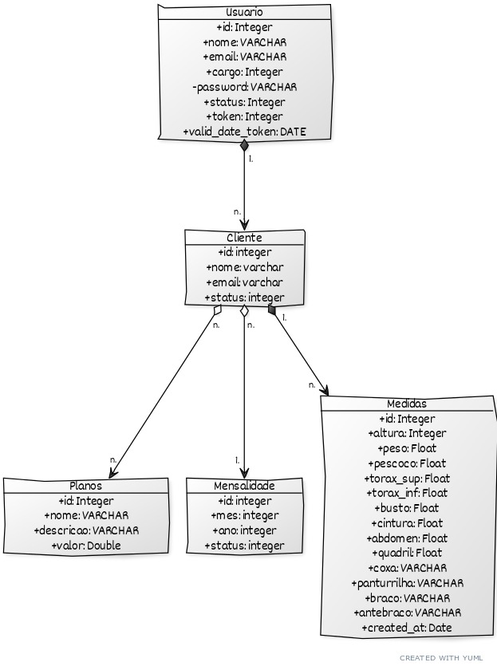

### UNIVERSIDADE FEDERAL DO RIO GRANDE DO NORTE

### CENTRO DE ENSINO SUPERIOR DO SERIDÓ

### DEPARTAMENTO DE COMPUTAÇÃO E TECNOLOGIA

### CURSO DE BACHARELADO EM SISTEMAS DE INFORMAÇÃO

#### EQUIPE JUREMASTEC SOCIAL

**Douglas Pacelli Maia Baltazar**

**Everton Ankelys Fernandes Bezerra**

**Fernando José dos Santos**

**José Rubens de Oliveira Júnior**

# QUARENDEMIA: Modelo Relacional



```yml
# Modelo Relacional

// Diagrama de Modelo Relacional
// --------- Quarendemia ---------

// Como criar ligações
//[Usuario]<>-orders*>[Cliente]++-0..*>[Planos]
[Usuario]++1.-n.>[Cliente]
[Cliente]<>n.-n.>[Planos]
[Cliente]<>n.-1.>[Mensalidade]
[Cliente]++1.-n.>[Medidas]

// Como adicionar anotações
// [Order]-[note: Aggregate Root ala DDD{bg:wheat}]

// Adicionando as tabelas.
[Usuario|+id: Integer;+nome: VARCHAR;+email: VARCHAR;+cargo: Integer;-password: VARCHAR;+status: Integer;+token: Integer;+valid_date_token: DATE]
[Planos|+id: Integer; +nome: VARCHAR; +descricao: VARCHAR; +valor: Double][Cliente|+id: integer; +nome: varchar; +email: varchar; +status: integer]
[Medidas|+id: Integer; +altura: Integer; +peso: Float; +pescoco: Float; +torax_sup: Float; +torax_inf: Float;+busto: Float; +cintura: Float; +abdomen: Float; +quadril: Float; +coxa: VARCHAR; +panturrilha: VARCHAR; +braco: VARCHAR; +antebraco: VARCHAR; +created_at: Date]
[mensalidade|+id: integer; +mes: integer; +ano: integer; +status: integer]
```
